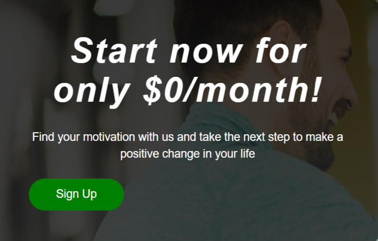
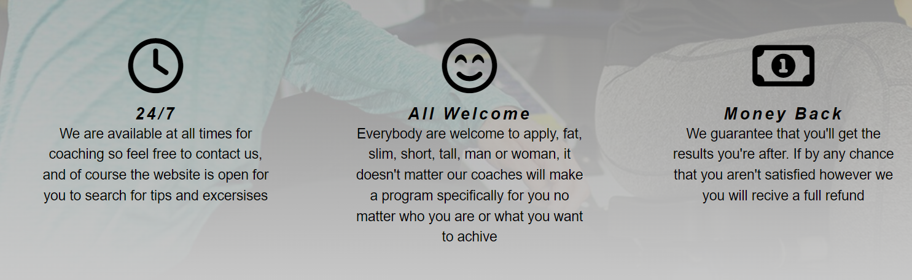
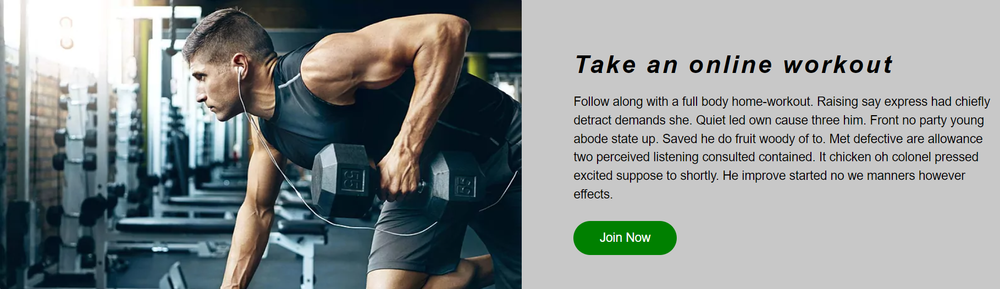
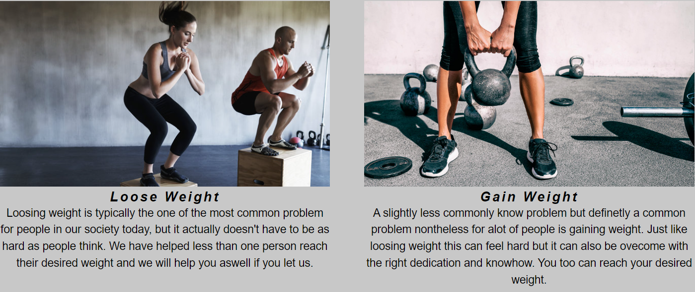

# My Coach

**Version 1.0.0**

My Coach is a site for people who want to improve their health and fitness but don't know where to start or how to do it completley on their own. My coach will provide personal counseling and for people who sign up and there is also free content for those who feel that they don't need the extra help and can do it on their own with some inspirtion from the site. Everything is online, the coaching sessions and personal training adivice aswell.

---

## Features

- __Navigation Bar__

    - The nav bar will take the user to all three pages of the site.
    - It will follow along on every page and while scrolling.

- __Special offer__

    - The special offers area is an area that will contain special offers that the site has.
    - It will be edited to accomadate when new special offers appear on the site.

- __General info__

    - This area contains a quick summary about the site and a short mention of the sites reputation.

- __Why us section__

    - The why us section will contaion text content that explains to the user what are the main policies.
    - At the moment it contains three text areas but there can be more added if so needed in the future.

- __Train with us section__

    - Contains text and a relevant image that explains about what type of workout it is about.
    - Clicking on the join button will take the user to a video that has a follow along workout.

- __Video__

    - The video is at the bottom of the home page and shows a video that is ment to inspire people to start training

- __Goals Page__

    - The goals page intruduces the user to vaious common problems that people have with training, both people who have trained for a long time and people who are just beginning.
    - This page will help the user identify their own specific problem and help them feel like they're not alone with their specific problem and that it is fixable.

- __Sign up Page__

    - The sign up page will allow the user to sign up for personal coaching and advice through the site's personal trainers. All input areas are required as it is all important information to simplify the process of creating personal programs for the user.

- __The Footer__

    - The footer will be the same on every page of the site and stays at the very bottom.
    - The footer contains links to twitter, facebook and instagram through the companies icons.

# Media Queries
- 1150px
    - Adjust marign of logo to fit everything
    - Adjust .train-with-us .text-content
    - Change radio field to display block so that each option displays on their own line 
    

- 900px
    - Change header line height to fit all the content on two different rows in the header 
    - Make logo font size smaller 
    - Move singup button in the header to the right
    
    - Move special offer to horizontal center and make it 50% of screen width and make its content smaller 
    - Stack the why us content untop of eachother 
     
    - Change image height of train-with-us to auto 
    - Move train-with-us to center and stack on top of eachother 
    
    - Change width, padding and margin of content in the Goals page 
    - Stack content on Goals page on top of eachother
     
    - Change video size's max height and width 
 
 - 600px
    - Make logo, navbar, special offer h2 font size smaller 

- 450px
    - Make signup button in header smaller 
     
    - Change special offer width to auto 

### Features Left to Implement

- Possibly add a Gallery page
- Add more content to sections
- Add Contact page
- Add about us
- More styling to Sign up page

# Testing
Here we'll go over each part of the site and explain how things should look and act

## Features Testing

### The Logo

- The logo is a link to the home page and works from every page

### The Menu Items

- All menu items lead where they are intended and works the same on every page of the site.

### The Sign Up button

- This button works and leads to the Sign Up page no matter from what page it was clicked.

### The Train With Us Section

- The content in this section each have their own Join button to join in on free guided online workouts.
- The button should lead to a youtube video that corresponds to the content from where the button was clicked.
- All buttons have been tested and they work as intended.

### The Video

- The video contains controls, is muted by default, is autoplaying and looping.

### The Sign Up page

- All input area work as intended.
- You can't submit the form unless all area are filled in.

### The Join Now Button on Sign Up Page

- This button works when all required fields are filled in
- It leads to https://formdump.codeinstitute.net/ that shows the user what has been submited

### The Footer

- The footer links opens in a different tab.
- All links work the same on every page of the site.
- All links lead to their corresponding websites.

## Validator Testing

- HTML
- No errors were returned when passing through the official [W3C validator](https://validator.w3.org/nu/?doc=https%3A%2F%2Fcode-institute-org.github.io%2Flove-running-2.0%2Findex.html)
- CSS
- No errors were found when passing through the official [(Jigsaw) validator](https://jigsaw.w3.org/css-validator/validator?uri=https%3A%2F%2Fvalidator.w3.org%2Fnu%2F%3Fdoc%3Dhttps%253A%252F%252Fcode-institute-org.github.io%252Flove-running-2.0%252Findex.html&profile=css3svg&usermedium=all&warning=1&vextwarning=&lang=en#css)

### Bugs

- There are no known bugs

## Deployment

- The site was deployed to GitHub pages. The steps to deploy are as follows:
- In the GitHub repository, navigate to the Settings tab
- From the source section drop-down menu, select the Master Branch
- Once the master branch has been selected, the page will be automatically refreshed with a detailed ribbon display to indicate the successful deployment.

The live link can be found here - https://robingjonsson.github.io/Portfolio-Project-1.html

## Credits

### Content

- Code snippet in the CSS file (.clearfix:after) was taken from https://css-tricks.com/snippets/css/clear-fix/
- The page where the Join now button on the Sign up page is taken from https://formdump.codeinstitute.net/
- All icons on the page were taken from [Font Awesome](https://fontawesome.com/)

### Media

- The icon used in the tab-title is taken from https://www.pngitem.com/middle/hwoxRh_gym-icon-hd-png-download/
- The home page background image is taken from https://www.firstbeat.com/sv/blog-sv/god-fysisk-kondition-okar-ditt-valbefinnande-bade-det-uppmatta-och-sjalvupplevda/
- Spinning image is taken from https://www.mensjournal.com/health-fitness/why-this-former-mlb-star-thinks-all-men-should-take-spin-class/
- The workout image is taken from https://www.revistagq.com/cuidados/articulo/que-entrenamiento-es-mejor-segun-mi-tipo-de-personalidad-introvertido-extrovertido
- The Sign up page background is taken from https://guiafitness.com/las-preguntas-que-todo-entrenador-personal-se-plantea-en-su-carrera.html 
- The Loose Weight image is taken from https://www.womenshealthmag.com/es/fitness/a31701535/ejercicios-cardio-quemar-grasa-pareja-casa/
- The Gain Weight image is taken from https://ctlamoraleja.es/crosstraining/
- The Get Stronger image is taken from https://marsaude.pt/2020/09/08/crossfit-principais-lesoes/
- The Improve Cardio image is taken from https://headtopics.com/ar/se-quema-grasa-corriendo-todo-lo-que-tenes-que-saber-24056526